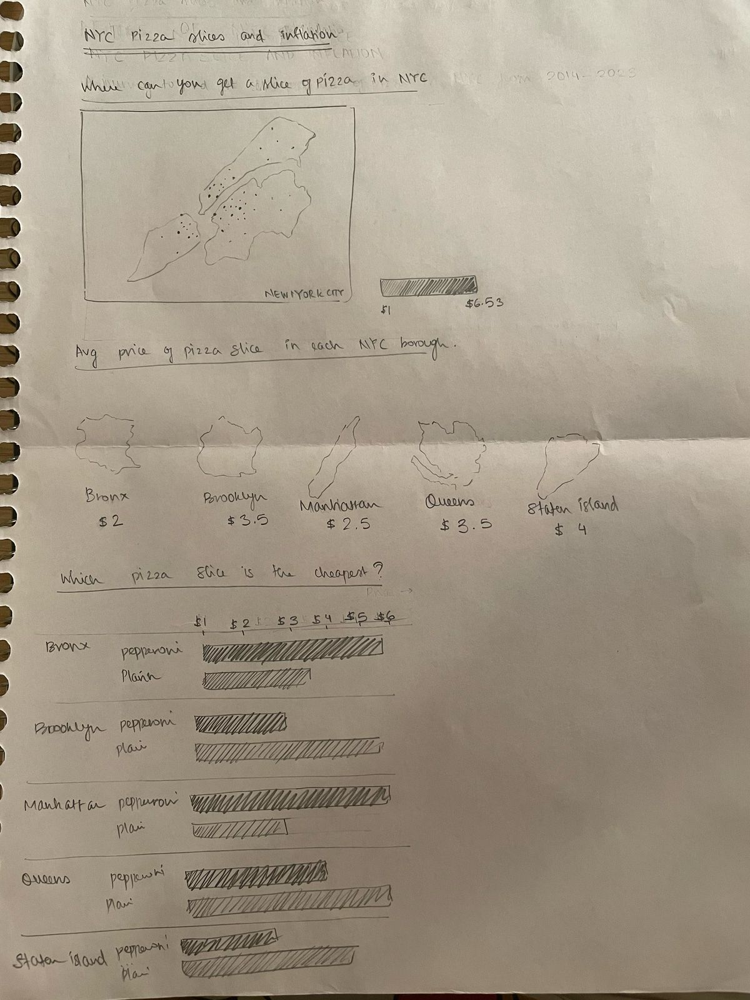

| [home page](https://cmustudent.github.io/tswd-portfolio-templates/) | [data viz examples](dataviz-examples) | [critique by design](critique-by-design) | [final project I](final-project-part-one) | [final project II](final-project-part-two) | [final project III](final-project-part-three) |

# Price of pizza slices in NYC 

## Step one: the visualization

The data chosen to visulaize was [NYC Pizza Slice](https://elkue.com/nyc-slice/)

The reason I chose to work on the redesign for this data was just because of how interesting this was. While I understand that overall, NYC has a LOT of pizza joints, there are so many things I am curious about - why the author chose to do this, why did he only try two specific kinds of pizzas, well at least majority of the time, and most importantly how he was consistent with it for more than 8 years! While looking at the data and analyzing it, I felt that there was something more that can be shown through this. Not just about pizza slices and their prices but also something about the economy as a whole. 

[Link](https://data.world/makeovermonday/2023w5) to the raw data sets and maps.  

## Step two: the critique

NYC Pizza Slice by Liam Quigley represents his journey of trying out pizza slices in New York City from 2014 to 2022. He also has a baseline for the price, which starts at $2.50, which is considered cheap, and goes up to approximately $6 a slice, which is expensive. What works great here is that the data only focuses on the pizza slices he has tried and includes the necessary attributes like where, when, and how much each slice costs. 

Apart from being curious and surprised about the number of pizza slices Liam has tried since 2014, what stood out to me was the map. I was able to instantly see parts of NYC that might have the greatest number of pizza joints to try from. This also gave me a sense of the kind of urban development that place might have. 
Liam also represents the trend in the price change with the years, which when observed can be seen that the base price of $2.50 went up to $3, and because the trend is represented with the years it becomes easy to understand that it might have been because of the inflation. The chart representing the trend of prices focuses only on two major types of pizzas (plain and pepperoni) that he has tried. While this might have been a choice made by the author, limiting price trends for only two of the pizza types; the ones that he tried most of the time, makes it easier for the audience to draw a comparison without creating distractions. 
A few things that I thought did not necessarily work – even though not mapped the data includes the time. While the date of when the pizza slice was tried could be important the time when it was tried may not be required, especially when showing it to a larger group of people. The heading may also be misleading in some cases, it does not say “what” about NYC pizza slices is being explored. Having a title that says something about the core of the data could be helpful, this eliminates the need to go through the article/data set to understand what is being visualized. While Liam categorizes pizza based on the topping, the ‘plain’ type is a little confusing – does plain mean with cheese or without it? This may not be confusing to people who are from America and understand the norms of pizza toppings, but it could be confusing to people who are not originally from the USA. 

What I would probably do differently is create a map that is symbolized by the price of the slice rather than the type of slice. That way people know the pizza joint that has the cheapest slice of pizza regardless of the type of pizza. Another thing that I would map is probably the list of places that Liam recommends – it has not been mapped, but because he provides a list creating a map of it might also help people choose a pizza joint that is cheap but also tastes good. 

## Step three: Sketch a solution

While the idea was to give people an idea about where they could possibly get the cheapest slice of pizza, I also thought it would be interesting to see if I could also show the pattern of inflation through it. While the author depicts a line graph with the prices of plain and pepperoni pizza from 2014 to 2023, during the time of inflation, around 2020 we see that there is a rise in the price of pizza slices. I thought this could be an interesting layer to add to the redeisgn. 

.jpeg)

## Step four: Test the solution

_Before you conduct your interviews, prepare a simple script.  Use this as a guide and as a way to take notes as you go forward. Come up with your own list of questions you want to ask for the selected visualization. Keep the questions broad so you can get the most value out of your feedback. Then, document answers to your questions here._

Questions to ask (modify these for your own interviews): 

- Can you tell me what you think this is?

- Can you describe to me what this is telling you?

- Is there anything you find surprising or confusing?

- Who do you think is the intended audience for this?

- Is there anything you would change or do differently?

Results: 

_Don't identify or share personally identifiable information (PII) about the people you spoke to._

| Question | Interview 1 | Interview 2 |
|----------|-------------|-------------|
|          |             |             |
|          |             |             |
|          |             |             |

Synthesis: 

_What patterns in the feedback emerge?  What did you learn from the feedback?  Based on this feedback, come up with what design changes you think might make the most sense in your final redesign._

## Step five: build the solution

_Include and describe your final solution here. It's also a good idea to summarize your thoughts on the process overall. When you're done with the assignment, this page should all the items mentioned in the assignment page on Canvas(a link or screenshot of the original data visualization, documentation explaining your process, a summary of your wireframes and user feedback, your final, redesigned data visualization, etc.)._

## References
_List any references you used here._

## AI acknowledgements
_If you used AI to help you complete this assignment (within the parameters of the instruction and course guidelines), detail your use of AI for this assignment here._

